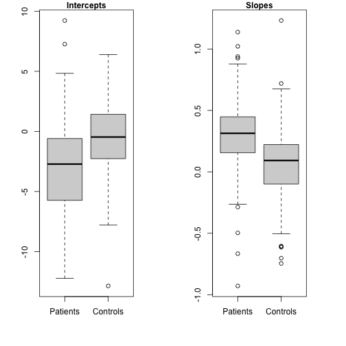

```r
## Basics

# arithmetic, interacting with the interpreter

# basic arithmetic operations

2 + 3 # addition
```

```
## [1] 5
```

```r
2 - 3 # subtraction
```

```
## [1] -1
```

```r
2*3   # multiplication
```

```
## [1] 6
```

```r
2/3   # division
```

```
## [1] 0.6666667
```

```r
2^3   # exponentiation
```

```
## [1] 8
```

```r
# precedence of operators

4^2 - 3*2
```

```
## [1] 10
```

```r
1 - 6 + 4
```

```
## [1] -1
```

```r
2^-3
```

```
## [1] 0.125
```

```r
(4^2) - (3*2) # use parentheses to group, clarify
```

```
## [1] 10
```

```r
4 + 3^2
```

```
## [1] 13
```

```r
(4 + 3)^2
```

```
## [1] 49
```

```r
-2--3
```

```
## [1] 1
```

```r
-2 - -3 # use spaces to clarify
```

```
## [1] 1
```

```r
# functions, arguments to functions, obtaining help and information

log(100) # natural log
```

```
## [1] 4.60517
```

```r
log(100, base=10) # log base-10
```

```
## [1] 2
```

```r
log10(100) # equivalent
```

```
## [1] 2
```

```r
log(100, b=10)  # argument abbreviation
```

```
## [1] 2
```

```r
args(log) # arguments of the log() function
```

```
## function (x, base = exp(1)) 
## NULL
```

```r
help("log")    # documentation
?log           # equivalent 
example("log") # execute examples in help page
```

```
## 
## log> log(exp(3))
## [1] 3
## 
## log> log10(1e7) # = 7
## [1] 7
## 
## log> x <- 10^-(1+2*1:9)
## 
## log> cbind(x, log(1+x), log1p(x), exp(x)-1, expm1(x))
##           x                                                    
##  [1,] 1e-03 9.995003e-04 9.995003e-04 1.000500e-03 1.000500e-03
##  [2,] 1e-05 9.999950e-06 9.999950e-06 1.000005e-05 1.000005e-05
##  [3,] 1e-07 1.000000e-07 1.000000e-07 1.000000e-07 1.000000e-07
##  [4,] 1e-09 1.000000e-09 1.000000e-09 1.000000e-09 1.000000e-09
##  [5,] 1e-11 1.000000e-11 1.000000e-11 1.000000e-11 1.000000e-11
##  [6,] 1e-13 9.992007e-14 1.000000e-13 9.992007e-14 1.000000e-13
##  [7,] 1e-15 1.110223e-15 1.000000e-15 1.110223e-15 1.000000e-15
##  [8,] 1e-17 0.000000e+00 1.000000e-17 0.000000e+00 1.000000e-17
##  [9,] 1e-19 0.000000e+00 1.000000e-19 0.000000e+00 1.000000e-19
```

```r
log(100, 10)  #  specifyingarguments by position
```

```
## [1] 2
```

```r
apropos("log")
```

```
##  [1] ".rs.api.showDialog"    ".rs.api.updateDialog"  ".rs.dialogIcon"        ".rs.logErrorMessage"   ".rs.logWarningMessage" "as.data.frame.logical"
##  [7] "as.logical"            "as.logical.factor"     "dlogis"                "is.logical"            "log"                   "log10"                
## [13] "log1p"                 "log2"                  "logb"                  "Logic"                 "logical"               "logLik"               
## [19] "loglin"                "plogis"                "qlogis"                "rlogis"                "SSlogis"
```

```r
help.search("log")

RSiteSearch("loglinear", "functions")
```

```
## A search query has been submitted to http://search.r-project.org
## The results page should open in your browser shortly
```

```r
# creating vectors

c(1, 2, 3, 4)  # combine
```

```
## [1] 1 2 3 4
```

```r
1:4     # integer-sequence operator
```

```
## [1] 1 2 3 4
```

```r
4:1
```

```
## [1] 4 3 2 1
```

```r
-1:2    # note precedence
```

```
## [1] -1  0  1  2
```

```r
-(1:2)
```

```
## [1] -1 -2
```

```r
seq(1, 4)
```

```
## [1] 1 2 3 4
```

```r
seq(2, 8, by=2) # specify interval
```

```
## [1] 2 4 6 8
```

```r
seq(0, 1, by=0.1) # non-integer sequence
```

```
##  [1] 0.0 0.1 0.2 0.3 0.4 0.5 0.6 0.7 0.8 0.9 1.0
```

```r
seq(0, 1, length=11) # specify number of elements
```

```
##  [1] 0.0 0.1 0.2 0.3 0.4 0.5 0.6 0.7 0.8 0.9 1.0
```

```r
# vectorized arithmetic

c(1, 2, 3, 4)/2
```

```
## [1] 0.5 1.0 1.5 2.0
```

```r
c(1, 2, 3, 4)/c(4, 3, 2, 1)
```

```
## [1] 0.2500000 0.6666667 1.5000000 4.0000000
```

```r
log(c(0.1, 1, 10, 100), 10)
```

```
## [1] -1  0  1  2
```

```r
c(1, 2, 3, 4) + c(4, 3) # recyling: no warning
```

```
## [1] 5 5 7 7
```

```r
c(1, 2, 3, 4) + c(4, 3, 2) # produces warning
```

```
## Warning in c(1, 2, 3, 4) + c(4, 3, 2): longer object length is not a multiple of shorter object length
```

```
## [1] 5 5 5 8
```

```r
# creating variables (named objects) by assignment

x <- c(1, 2, 3, 4) # assignment
x # print
```

```
## [1] 1 2 3 4
```

```r
x = c(1, 2, 3, 4) # can use = for assignment (best avoided)
x
```

```
## [1] 1 2 3 4
```

```r
x/2            # equivalent to c(1, 2, 3, 4)/2
```

```
## [1] 0.5 1.0 1.5 2.0
```

```r
(y <- sqrt(x)) # parentheses to assign and print trick
```

```
## [1] 1.000000 1.414214 1.732051 2.000000
```

```r
(x <- rnorm(100))
```

```
##   [1] -0.33322537 -0.19332815 -1.64087969  0.66714419 -0.60497848 -0.62010262  2.32542591  0.04915469  0.14205569 -0.70842202 -0.48783951  0.45084157  1.18474492
##  [14] -0.37816504 -0.76318362 -0.92211351 -0.58093114  1.31525906  3.24976866 -0.77021237  0.68893739 -0.15231637 -0.03173490 -1.47239502  1.76324912 -0.93775350
##  [27]  0.48053442  0.89127743 -0.98918316 -0.77422358  0.82964575  0.08029770 -1.49101882 -1.34365379  0.33383712 -1.07091338  0.73086582  1.17255588  0.26908617
##  [40] -0.21237525  0.22110052 -0.01986519 -0.30463962 -0.37145530 -0.42747314 -0.15754736  2.15214541  0.03557617  0.44364764 -0.39657630 -0.94133862  1.93260500
##  [53]  0.31458036  0.22884727  1.60158990 -2.00190151 -0.13060263  0.96298550  0.92498731  1.12151182  2.07591121 -1.89572207  0.31212466 -0.73835164  1.79194815
##  [66]  1.81147412 -0.45047089 -0.54522089  0.57364067  0.35575846  0.05873892 -1.42835871 -0.13020129  0.94746288  1.17664557  1.21066582  1.38003360  0.34238689
##  [79] -0.90133199 -0.40456627 -1.40901391  0.23573781  1.02825439  0.16621541  2.20727300  0.18904625  0.30280753 -0.54672173  0.83301996 -0.58372527 -1.40596675
##  [92] -2.97414141  1.21169282 -1.56113532 -1.55184452  0.12572961  1.03558069  0.58483294 -2.47428866 -1.19280978
```

```r
head(x) # first few
```

```
## [1] -0.3332254 -0.1933282 -1.6408797  0.6671442 -0.6049785 -0.6201026
```

```r
summary(x)  # a "generic" function
```

```
##     Min.  1st Qu.   Median     Mean  3rd Qu.     Max. 
## -2.97414 -0.64218  0.05395  0.05097  0.83049  3.24977
```

```r
# character and logical data

(words <- c("To", "be", "or", "not", "to", "be"))
```

```
## [1] "To"  "be"  "or"  "not" "to"  "be"
```

```r
paste(words, collapse=" ")
```

```
## [1] "To be or not to be"
```

```r
(logical.values <- c(TRUE, TRUE, FALSE, TRUE))
```

```
## [1]  TRUE  TRUE FALSE  TRUE
```

```r
!logical.values # negation (not operator)
```

```
## [1] FALSE FALSE  TRUE FALSE
```

```r
# coercion

sum(logical.values)      # number of TRUEs (coercion to numeric)
```

```
## [1] 3
```

```r
sum(!logical.values)     # number of FALSEs (TRUE-> 1, FALSE -> 0)
```

```
## [1] 1
```

```r
c("A", FALSE, 3.0)       # coerced to character
```

```
## [1] "A"     "FALSE" "3"
```

```r
c(10, FALSE, -6.5, TRUE) # coerced to numeric
```

```
## [1] 10.0  0.0 -6.5  1.0
```

```r
# basic indexing

x[12]             # 12th element
```

```
## [1] 0.4508416
```

```r
words[2]          # second element
```

```
## [1] "be"
```

```r
logical.values[3] # third element
```

```
## [1] FALSE
```

```r
x[6:15]           # elements 6 through 15
```

```
##  [1] -0.62010262  2.32542591  0.04915469  0.14205569 -0.70842202 -0.48783951  0.45084157  1.18474492 -0.37816504 -0.76318362
```

```r
x[c(1, 3, 5)]     # 1st, 3rd, 5th elements 
```

```
## [1] -0.3332254 -1.6408797 -0.6049785
```

```r
x[-(11:100)] # omit elements 11 through 100
```

```
##  [1] -0.33322537 -0.19332815 -1.64087969  0.66714419 -0.60497848 -0.62010262  2.32542591  0.04915469  0.14205569 -0.70842202
```

```r
x[1:10]      # same!
```

```
##  [1] -0.33322537 -0.19332815 -1.64087969  0.66714419 -0.60497848 -0.62010262  2.32542591  0.04915469  0.14205569 -0.70842202
```

```r
v <- 1:4
v[c(TRUE, FALSE, FALSE, TRUE)] # logical indexing
```

```
## [1] 1 4
```

```r
#comparison and logical operators

1 == 2       # equal to
```

```
## [1] FALSE
```

```r
1 != 2       # not equal to
```

```
## [1] TRUE
```

```r
1 <= 2       # less than or equal to
```

```
## [1] TRUE
```

```r
1 < 1:3      # less than (vectorized) 
```

```
## [1] FALSE  TRUE  TRUE
```

```r
3:1 > 1:3    # greater than
```

```
## [1]  TRUE FALSE FALSE
```

```r
3:1 >= 1:3   # greater than or equal to
```

```
## [1]  TRUE  TRUE FALSE
```

```r
TRUE & c(TRUE, FALSE)                        # logical and
```

```
## [1]  TRUE FALSE
```

```r
c(TRUE, FALSE, FALSE) | c(TRUE, TRUE, FALSE) # logical or
```

```
## [1]  TRUE  TRUE FALSE
```

```r
(z <- x[1:10])      # first 10 elements of x
```

```
##  [1] -0.33322537 -0.19332815 -1.64087969  0.66714419 -0.60497848 -0.62010262  2.32542591  0.04915469  0.14205569 -0.70842202
```

```r
z < -0.5            # is each element less than -0.5?
```

```
##  [1] FALSE FALSE  TRUE FALSE  TRUE  TRUE FALSE FALSE FALSE  TRUE
```

```r
z > 0.5             # is each element greater than 0.5
```

```
##  [1] FALSE FALSE FALSE  TRUE FALSE FALSE  TRUE FALSE FALSE FALSE
```

```r
z < -0.5 | z > 0.5  #  < and > are of higher precedence than |
```

```
##  [1] FALSE FALSE  TRUE  TRUE  TRUE  TRUE  TRUE FALSE FALSE  TRUE
```

```r
abs(z) > 0.5        # absolute value, equivalent to last expression
```

```
##  [1] FALSE FALSE  TRUE  TRUE  TRUE  TRUE  TRUE FALSE FALSE  TRUE
```

```r
z[abs(z) > 0.5]     # values of z for which |z| > 0.5
```

```
## [1] -1.6408797  0.6671442 -0.6049785 -0.6201026  2.3254259 -0.7084220
```

```r
# user-defined functions

mean(x)  # of 100 random-normal numbers
```

```
## [1] 0.0509702
```

```r
sum(x)/length(x)  # equivalent
```

```
## [1] 0.0509702
```

```r
myMean <- function(x) {
  sum(x)/length(x)
}
myMean # can be printed like any object
```

```
## function(x) {
##   sum(x)/length(x)
## }
```

```r
myMean(x)
```

```
## [1] 0.0509702
```

```r
y # from sqrt(c(1, 2, 3, 4))
```

```
## [1] 1.000000 1.414214 1.732051 2.000000
```

```r
myMean(y)
```

```
## [1] 1.536566
```

```r
myMean(1:100)
```

```
## [1] 50.5
```

```r
head(x) # global x undisturbed
```

```
## [1] -0.3332254 -0.1933282 -1.6408797  0.6671442 -0.6049785 -0.6201026
```

```r
mySD <- function(x) {
  sqrt(sum((x - myMean(x))^2)/(length(x) - 1))
}
mySD(1:100)
```

```
## [1] 29.01149
```

```r
sd(1:100) # check
```

```
## [1] 29.01149
```

```r
# cleaning up

objects()
```

```
## [1] "logical.values" "myMean"         "mySD"           "v"              "words"          "x"              "y"              "z"
```

```r
remove(v, x, y, z, logical.values, words)
objects()
```

```
## [1] "myMean" "mySD"
```

```r
# using traceback()

letters
```

```
##  [1] "a" "b" "c" "d" "e" "f" "g" "h" "i" "j" "k" "l" "m" "n" "o" "p" "q" "r" "s" "t" "u" "v" "w" "x" "y" "z"
```

```r
mySD(letters)
```

```
## Error in sum(x): invalid 'type' (character) of argument
```

```r
traceback()
```

```
## 3: parse(text = x, keep.source = TRUE)
## 2: getParseData(parse(text = x, keep.source = TRUE))
## 1: knitr::spin("report.R")
```

```r
## Workflow

# Using scripts

# An illustrative data analysis: Duncan's occupational prestige regression

library("car")      # load car package (for functions and data)
```

```
## Loading required package: carData
```

```r
Duncan <- read.table("Duncan.txt", header=TRUE)
```

```
## Warning in file(file, "rt"): cannot open file 'Duncan.txt': No such file or directory
```

```
## Error in file(file, "rt"): cannot open the connection
```

```r
head(Duncan, n=10)  # first 10 cases
```

```
##            type income education prestige
## accountant prof     62        86       82
## pilot      prof     72        76       83
## architect  prof     75        92       90
## author     prof     55        90       76
## chemist    prof     64        86       90
## minister   prof     21        84       87
## professor  prof     64        93       93
## dentist    prof     80       100       90
## reporter     wc     67        87       52
## engineer   prof     72        86       88
```

```r
brief(Duncan)       # abbreviated output
```

```
## 45 x 4 data.frame (40 rows omitted)
##            type income education prestige
##             [f]    [i]       [i]      [i]
## accountant prof     62        86       82
## pilot      prof     72        76       83
## architect  prof     75        92       90
## . . .                                         
## policeman  bc       34        47       41
## waiter     bc        8        32       10
```

```r
dim(Duncan)         # rows and columns
```

```
## [1] 45  4
```

```r
View(Duncan)        # in the RStudio data viewer
summary(Duncan)     # invoking the summary() generic function
```

```
##    type        income        education         prestige    
##  bc  :21   Min.   : 7.00   Min.   :  7.00   Min.   : 3.00  
##  prof:18   1st Qu.:21.00   1st Qu.: 26.00   1st Qu.:16.00  
##  wc  : 6   Median :42.00   Median : 45.00   Median :41.00  
##            Mean   :41.87   Mean   : 52.56   Mean   :47.69  
##            3rd Qu.:64.00   3rd Qu.: 84.00   3rd Qu.:81.00  
##            Max.   :81.00   Max.   :100.00   Max.   :97.00
```

```r
help("Duncan")      # codebook for the data set (copy in carData package)

# Examining the Data

with(Duncan, hist(prestige))
```


```r
scatterplotMatrix( ~ prestige + education + income, 
                   id=list(n=3), data=Duncan)
```


```r
# Duncan's regression

(duncan.model <- lm(prestige ~ education + income, data=Duncan))
```

```
## 
## Call:
## lm(formula = prestige ~ education + income, data = Duncan)
## 
## Coefficients:
## (Intercept)    education       income  
##     -6.0647       0.5458       0.5987
```

```r
summary(duncan.model)  # more detailed report
```

```
## 
## Call:
## lm(formula = prestige ~ education + income, data = Duncan)
## 
## Residuals:
##     Min      1Q  Median      3Q     Max 
## -29.538  -6.417   0.655   6.605  34.641 
## 
## Coefficients:
##             Estimate Std. Error t value Pr(>|t|)    
## (Intercept) -6.06466    4.27194  -1.420    0.163    
## education    0.54583    0.09825   5.555 1.73e-06 ***
## income       0.59873    0.11967   5.003 1.05e-05 ***
## ---
## Signif. codes:  0 '***' 0.001 '**' 0.01 '*' 0.05 '.' 0.1 ' ' 1
## 
## Residual standard error: 13.37 on 42 degrees of freedom
## Multiple R-squared:  0.8282,	Adjusted R-squared:   0.82 
## F-statistic: 101.2 on 2 and 42 DF,  p-value: < 2.2e-16
```

```r
# some regression diagnostics

# distribution of the (studentized) residuals

densityPlot(rstudent(duncan.model))
```


```r
qqPlot(duncan.model, id=list(n=3))
```


```
##   minister   reporter contractor 
##          6          9         17
```

```r
outlierTest(duncan.model)
```

```
## No Studentized residuals with Bonferroni p < 0.05
## Largest |rstudent|:
##          rstudent unadjusted p-value Bonferroni p
## minister 3.134519          0.0031772      0.14297
```

```r
# influence diagnostics

influencePlot(duncan.model, id=list(n=3))
```


```
##                StudRes        Hat      CookD
## minister     3.1345186 0.17305816 0.56637974
## reporter    -2.3970224 0.05439356 0.09898456
## conductor   -1.7040324 0.19454165 0.22364122
## contractor   2.0438046 0.04325517 0.05852346
## RR.engineer  0.8089221 0.26908963 0.08096807
```

```r
avPlots(duncan.model, id=list(n=3, method="mahal"))
```


```r
# nonlinearity diagnostic

crPlots(duncan.model)
```


```r
# nonconstant-spread diagnostics

spreadLevelPlot(duncan.model)
```


```
## 
## Suggested power transformation:  0.8653151
```

```r
ncvTest(duncan.model)
```

```
## Non-constant Variance Score Test 
## Variance formula: ~ fitted.values 
## Chisquare = 0.3810967, Df = 1, p = 0.53702
```

```r
ncvTest(duncan.model, var.formula= ~ income + education)
```

```
## Non-constant Variance Score Test 
## Variance formula: ~ income + education 
## Chisquare = 0.6976023, Df = 2, p = 0.70553
```

```r
# refit without ministers and conductors

duncan.model.2 <- update(duncan.model, 
                         subset = !(rownames(Duncan) %in% c("minister", "conductor")))
summary(duncan.model.2)
```

```
## 
## Call:
## lm(formula = prestige ~ education + income, data = Duncan, subset = !(rownames(Duncan) %in% 
##     c("minister", "conductor")))
## 
## Residuals:
##     Min      1Q  Median      3Q     Max 
## -28.612  -5.898   1.937   5.616  21.551 
## 
## Coefficients:
##             Estimate Std. Error t value Pr(>|t|)    
## (Intercept) -6.40899    3.65263  -1.755   0.0870 .  
## education    0.33224    0.09875   3.364   0.0017 ** 
## income       0.86740    0.12198   7.111 1.31e-08 ***
## ---
## Signif. codes:  0 '***' 0.001 '**' 0.01 '*' 0.05 '.' 0.1 ' ' 1
## 
## Residual standard error: 11.42 on 40 degrees of freedom
## Multiple R-squared:  0.876,	Adjusted R-squared:  0.8698 
## F-statistic: 141.3 on 2 and 40 DF,  p-value: < 2.2e-16
```

```r
compareCoefs(duncan.model, duncan.model.2)
```

```
## Calls:
## 1: lm(formula = prestige ~ education + income, data = Duncan)
## 2: lm(formula = prestige ~ education + income, data = Duncan, subset = !(rownames(Duncan) %in% c("minister", "conductor")))
## 
##             Model 1 Model 2
## (Intercept)   -6.06   -6.41
## SE             4.27    3.65
##                            
## education    0.5458  0.3322
## SE           0.0983  0.0987
##                            
## income        0.599   0.867
## SE            0.120   0.122
## 
```

```r
# using R Markdown: in file RMarkdown-examples.Rmd

## Linear models in R

# multiple regression (Prestige data)

names(Prestige) # from carData package
```

```
## [1] "education" "income"    "women"     "prestige"  "census"    "type"
```

```r
some(Prestige)  # 10 randomly sampling observations
```

```
##                        education income women prestige census type
## gov.administrators         13.11  12351 11.16     68.8   1113 prof
## psychologists              14.36   7405 48.28     74.9   2315 prof
## social.workers             14.21   6336 54.77     55.1   2331 prof
## physio.therapsts           13.62   5092 82.66     72.1   3137 prof
## collectors                 11.20   4741 47.06     29.4   4191   wc
## firefighters                9.47   8895  0.00     43.5   6111   bc
## janitors                    7.11   3472 33.57     17.3   6191   bc
## electrical.linemen          9.05   8316  1.34     40.9   8731   bc
## construction.labourers      7.52   3910  1.09     26.5   8798   bc
## taxi.drivers                7.93   4224  3.59     25.1   9173   bc
```

```r
brief(Prestige)
```

```
## 102 x 6 data.frame (97 rows omitted)
##                    education income women prestige census type
##                          [n]    [i]   [n]      [n]    [i]  [f]
## gov.administrators     13.11  12351 11.16     68.8   1113 prof
## general.managers       12.26  25879  4.02     69.1   1130 prof
## accountants            12.77   9271 15.70     63.4   1171 prof
## . . .                                                              
## typesetters            10.00   6462 13.58     42.2   9511 bc  
## bookbinders             8.55   3617 70.87     35.2   9517 bc
```

```r
View(Prestige)
?Prestige       #help on data set

prestige.mod.1 <- lm(prestige ~ education + log2(income) + women,
                     data=Prestige)  
summary(prestige.mod.1)
```

```
## 
## Call:
## lm(formula = prestige ~ education + log2(income) + women, data = Prestige)
## 
## Residuals:
##     Min      1Q  Median      3Q     Max 
## -17.364  -4.429  -0.101   4.316  19.179 
## 
## Coefficients:
##               Estimate Std. Error t value Pr(>|t|)    
## (Intercept)  -110.9658    14.8429  -7.476 3.27e-11 ***
## education       3.7305     0.3544  10.527  < 2e-16 ***
## log2(income)    9.3147     1.3265   7.022 2.90e-10 ***
## women           0.0469     0.0299   1.568     0.12    
## ---
## Signif. codes:  0 '***' 0.001 '**' 0.01 '*' 0.05 '.' 0.1 ' ' 1
## 
## Residual standard error: 7.093 on 98 degrees of freedom
## Multiple R-squared:  0.8351,	Adjusted R-squared:   0.83 
## F-statistic: 165.4 on 3 and 98 DF,  p-value: < 2.2e-16
```

```r
S(prestige.mod.1)
```

```
## Call: lm(formula = prestige ~ education + log2(income) + women, data = Prestige)
## 
## Coefficients:
##               Estimate Std. Error t value Pr(>|t|)    
## (Intercept)  -110.9658    14.8429  -7.476 3.27e-11 ***
## education       3.7305     0.3544  10.527  < 2e-16 ***
## log2(income)    9.3147     1.3265   7.022 2.90e-10 ***
## women           0.0469     0.0299   1.568     0.12    
## ---
## Signif. codes:  0 '***' 0.001 '**' 0.01 '*' 0.05 '.' 0.1 ' ' 1
## 
## Residual standard deviation: 7.093 on 98 degrees of freedom
## Multiple R-squared: 0.8351
## F-statistic: 165.4 on 3 and 98 DF,  p-value: < 2.2e-16 
##    AIC    BIC 
## 695.03 708.15
```

```r
brief(prestige.mod.1)
```

```
##            (Intercept) education log2(income)  women
## Estimate        -111.0     3.731         9.31 0.0469
## Std. Error        14.8     0.354         1.33 0.0299
## 
##  Residual SD = 7.09 on 98 df, R-squared = 0.835
```

```r
# dummy regression

Prestige$type # a factor
```

```
##   [1] prof prof prof prof prof prof prof prof prof prof prof prof prof prof prof prof prof prof prof prof prof prof prof prof prof prof prof bc   prof prof wc  
##  [32] prof wc   <NA> wc   wc   wc   wc   wc   wc   wc   wc   wc   wc   wc   wc   wc   wc   wc   wc   wc   wc   <NA> bc   wc   wc   wc   bc   bc   bc   bc   bc  
##  [63] <NA> bc   bc   bc   <NA> bc   bc   bc   bc   bc   bc   bc   bc   bc   bc   bc   bc   bc   bc   bc   bc   bc   bc   bc   bc   bc   bc   bc   bc   bc   bc  
##  [94] bc   bc   prof bc   bc   bc   bc   bc   bc  
## Levels: bc prof wc
```

```r
class(Prestige$type) 
```

```
## [1] "factor"
```

```r
str(Prestige$type) # structure: also see RStudio Environment tab
```

```
##  Factor w/ 3 levels "bc","prof","wc": 2 2 2 2 2 2 2 2 2 2 ...
```

```r
Prestige.2 <- na.omit(Prestige) # filter out missing data
nrow(Prestige)
```

```
## [1] 102
```

```r
nrow(Prestige.2)
```

```
## [1] 98
```

```r
levels(Prestige.2$type)
```

```
## [1] "bc"   "prof" "wc"
```

```r
Prestige.2$type <- with(Prestige.2, 
                        factor(type, levels=c("bc", "wc", "prof"))) # reorder levels
Prestige.2$type
```

```
##  [1] prof prof prof prof prof prof prof prof prof prof prof prof prof prof prof prof prof prof prof prof prof prof prof prof prof prof prof bc   prof prof wc  
## [32] prof wc   wc   wc   wc   wc   wc   wc   wc   wc   wc   wc   wc   wc   wc   wc   wc   wc   wc   wc   bc   wc   wc   wc   bc   bc   bc   bc   bc   bc   bc  
## [63] bc   bc   bc   bc   bc   bc   bc   bc   bc   bc   bc   bc   bc   bc   bc   bc   bc   bc   bc   bc   bc   bc   bc   bc   bc   bc   bc   bc   bc   prof bc  
## [94] bc   bc   bc   bc   bc  
## Levels: bc wc prof
```

```r
# generating contrasts from factors

getOption("contrasts")
```

```
##         unordered           ordered 
## "contr.treatment"      "contr.poly"
```

```r
contrasts(Prestige.2$type)
```

```
##      wc prof
## bc    0    0
## wc    1    0
## prof  0    1
```

```r
model.matrix(~ type, data=Prestige.2)
```

```
##                           (Intercept) typewc typeprof
## gov.administrators                  1      0        1
## general.managers                    1      0        1
## accountants                         1      0        1
## purchasing.officers                 1      0        1
## chemists                            1      0        1
## physicists                          1      0        1
## biologists                          1      0        1
## architects                          1      0        1
## civil.engineers                     1      0        1
## mining.engineers                    1      0        1
## surveyors                           1      0        1
## draughtsmen                         1      0        1
## computer.programers                 1      0        1
## economists                          1      0        1
## psychologists                       1      0        1
## social.workers                      1      0        1
## lawyers                             1      0        1
## librarians                          1      0        1
## vocational.counsellors              1      0        1
## ministers                           1      0        1
## university.teachers                 1      0        1
## primary.school.teachers             1      0        1
## secondary.school.teachers           1      0        1
## physicians                          1      0        1
## veterinarians                       1      0        1
## osteopaths.chiropractors            1      0        1
## nurses                              1      0        1
## nursing.aides                       1      0        0
## physio.therapsts                    1      0        1
## pharmacists                         1      0        1
## medical.technicians                 1      1        0
## commercial.artists                  1      0        1
## radio.tv.announcers                 1      1        0
## secretaries                         1      1        0
## typists                             1      1        0
## bookkeepers                         1      1        0
## tellers.cashiers                    1      1        0
## computer.operators                  1      1        0
## shipping.clerks                     1      1        0
## file.clerks                         1      1        0
## receptionsts                        1      1        0
## mail.carriers                       1      1        0
## postal.clerks                       1      1        0
## telephone.operators                 1      1        0
## collectors                          1      1        0
## claim.adjustors                     1      1        0
## travel.clerks                       1      1        0
## office.clerks                       1      1        0
## sales.supervisors                   1      1        0
## commercial.travellers               1      1        0
## sales.clerks                        1      1        0
## service.station.attendant           1      0        0
## insurance.agents                    1      1        0
## real.estate.salesmen                1      1        0
## buyers                              1      1        0
## firefighters                        1      0        0
## policemen                           1      0        0
## cooks                               1      0        0
## bartenders                          1      0        0
## funeral.directors                   1      0        0
## launderers                          1      0        0
## janitors                            1      0        0
## elevator.operators                  1      0        0
## farm.workers                        1      0        0
## rotary.well.drillers                1      0        0
## bakers                              1      0        0
## slaughterers.1                      1      0        0
## slaughterers.2                      1      0        0
## canners                             1      0        0
## textile.weavers                     1      0        0
## textile.labourers                   1      0        0
## tool.die.makers                     1      0        0
## machinists                          1      0        0
## sheet.metal.workers                 1      0        0
## welders                             1      0        0
## auto.workers                        1      0        0
## aircraft.workers                    1      0        0
## electronic.workers                  1      0        0
## radio.tv.repairmen                  1      0        0
## sewing.mach.operators               1      0        0
## auto.repairmen                      1      0        0
## aircraft.repairmen                  1      0        0
## railway.sectionmen                  1      0        0
## electrical.linemen                  1      0        0
## electricians                        1      0        0
## construction.foremen                1      0        0
## carpenters                          1      0        0
## masons                              1      0        0
## house.painters                      1      0        0
## plumbers                            1      0        0
## construction.labourers              1      0        0
## pilots                              1      0        1
## train.engineers                     1      0        0
## bus.drivers                         1      0        0
## taxi.drivers                        1      0        0
## longshoremen                        1      0        0
## typesetters                         1      0        0
## bookbinders                         1      0        0
## attr(,"assign")
## [1] 0 1 1
## attr(,"contrasts")
## attr(,"contrasts")$type
## [1] "contr.treatment"
```

```r
contrasts(Prestige.2$type) <- contr.treatment(levels(Prestige.2$type), base=2)
# changing baseline level
contrasts(Prestige.2$type)
```

```
##      bc prof
## bc    1    0
## wc    0    0
## prof  0    1
```

```r
contrasts(Prestige.2$type) <- "contr.sum"  # "deviation" contrasts
contrasts(Prestige.2$type)
```

```
##      [,1] [,2]
## bc      1    0
## wc      0    1
## prof   -1   -1
```

```r
contrasts(Prestige.2$type) <- NULL  # back to default

prestige.mod.2 <- lm(prestige ~ log2(income) + education + type, 
                     data=Prestige.2)
S(prestige.mod.2)
```

```
## Call: lm(formula = prestige ~ log2(income) + education + type, data = Prestige.2)
## 
## Coefficients:
##              Estimate Std. Error t value Pr(>|t|)    
## (Intercept)  -81.2019    13.7431  -5.909 5.63e-08 ***
## log2(income)   7.2694     1.1900   6.109 2.31e-08 ***
## education      3.2845     0.6081   5.401 5.06e-07 ***
## typewc        -1.4394     2.3780  -0.605   0.5465    
## typeprof       6.7509     3.6185   1.866   0.0652 .  
## ---
## Signif. codes:  0 '***' 0.001 '**' 0.01 '*' 0.05 '.' 0.1 ' ' 1
## 
## Residual standard deviation: 6.637 on 93 degrees of freedom
## Multiple R-squared: 0.8555
## F-statistic: 137.6 on 4 and 93 DF,  p-value: < 2.2e-16 
##    AIC    BIC 
## 655.93 671.44
```

```r
scatter3d(prestige ~ log2(income) + education | type, 
          parallel=TRUE, data=Prestige) # uses rgl package, need XQuartz in macOS
```

```
## Loading required namespace: rgl
```

```
## Error in scatter3d(prestige ~ log2(income) + education | type, parallel = TRUE, : rgl package missing
```

```r
prestige.mod.3 <- update(prestige.mod.2, 
                         . ~ . + log2(income):type + education:type)  # adding interactions
S(prestige.mod.3)
```

```
## Call: lm(formula = prestige ~ log2(income) + education + type + log2(income):type + education:type, data = Prestige.2)
## 
## Coefficients:
##                        Estimate Std. Error t value Pr(>|t|)    
## (Intercept)           -120.0459    20.1576  -5.955 5.07e-08 ***
## log2(income)            11.0782     1.8063   6.133 2.32e-08 ***
## education                2.3357     0.9277   2.518  0.01360 *  
## typewc                  30.2412    37.9788   0.796  0.42800    
## typeprof                85.1601    31.1810   2.731  0.00761 ** 
## log2(income):typewc     -5.6530     3.0519  -1.852  0.06730 .  
## log2(income):typeprof   -6.5356     2.6167  -2.498  0.01434 *  
## education:typewc         3.6400     1.7589   2.069  0.04140 *  
## education:typeprof       0.6974     1.2895   0.541  0.58998    
## ---
## Signif. codes:  0 '***' 0.001 '**' 0.01 '*' 0.05 '.' 0.1 ' ' 1
## 
## Residual standard deviation: 6.409 on 89 degrees of freedom
## Multiple R-squared: 0.871
## F-statistic: 75.15 on 8 and 89 DF,  p-value: < 2.2e-16 
##    AIC    BIC 
## 652.77 678.62
```

```r
scatter3d(prestige ~ log2(income) + education | type, 
          parallel=FALSE, data=Prestige)
```

```
## Loading required namespace: rgl
```

```
## Error in scatter3d(prestige ~ log2(income) + education | type, parallel = FALSE, : rgl package missing
```

```r
# equivalent specifications:

brief(lm(prestige ~ log2(income)*type + education*type, 
         data=Prestige.2))
```

```
##            (Intercept) log2(income) typewc typeprof education log2(income):typewc log2(income):typeprof typewc:education typeprof:education
## Estimate        -120.0        11.08   30.2     85.2     2.336               -5.65                 -6.54             3.64              0.697
## Std. Error        20.2         1.81   38.0     31.2     0.928                3.05                  2.62             1.76              1.290
## 
##  Residual SD = 6.41 on 89 df, R-squared = 0.871
```

```r
brief(lm(prestige ~ (log2(income) + education)*type, 
         data=Prestige.2))
```

```
##            (Intercept) log2(income) education typewc typeprof log2(income):typewc log2(income):typeprof education:typewc education:typeprof
## Estimate        -120.0        11.08     2.336   30.2     85.2               -5.65                 -6.54             3.64              0.697
## Std. Error        20.2         1.81     0.928   38.0     31.2                3.05                  2.62             1.76              1.290
## 
##  Residual SD = 6.41 on 89 df, R-squared = 0.871
```

```r
## Generalized linear models

# binary logit model

?Cowles

mod.cowles <- glm(volunteer ~ sex + extraversion*neuroticism, 
                  family=binomial, data=Cowles)
S(mod.cowles)
```

```
## Call: glm(formula = volunteer ~ sex + extraversion * neuroticism, family = binomial, data = Cowles)
## 
## Coefficients:
##                           Estimate Std. Error z value Pr(>|z|)    
## (Intercept)              -2.358207   0.501320  -4.704 2.55e-06 ***
## sexmale                  -0.247152   0.111631  -2.214  0.02683 *  
## extraversion              0.166816   0.037719   4.423 9.75e-06 ***
## neuroticism               0.110777   0.037648   2.942  0.00326 ** 
## extraversion:neuroticism -0.008552   0.002934  -2.915  0.00355 ** 
## ---
## Signif. codes:  0 '***' 0.001 '**' 0.01 '*' 0.05 '.' 0.1 ' ' 1
## 
## (Dispersion parameter for binomial family taken to be 1)
## 
##     Null deviance: 1933.5  on 1420  degrees of freedom
## Residual deviance: 1897.4  on 1416  degrees of freedom
## 
##  logLik      df     AIC     BIC 
## -948.72       5 1907.44 1933.74 
## 
## Number of Fisher Scoring iterations: 4
## 
## Exponentiated Coefficients and Confidence Bounds
##                            Estimate      2.5 %    97.5 %
## (Intercept)              0.09458964 0.03485603 0.2492859
## sexmale                  0.78102195 0.62724342 0.9717129
## extraversion             1.18153740 1.09828160 1.2735034
## neuroticism              1.11714535 1.03815341 1.2034925
## extraversion:neuroticism 0.99148400 0.98575501 0.9971703
```

```r
# Poisson and quasi-Poisson regression

some(Ornstein)
```

```
##     assets sector nation interlocks
## 46    6571    FIN    CAN          9
## 84    2927    MIN    OTH         35
## 92    2625    AGR     UK         10
## 100   2164    MIN    OTH         13
## 178    559    MAN     US          7
## 194    494    MER    CAN          8
## 198    456    MIN     US          5
## 217    359    AGR     US          0
## 239    225    AGR     US          6
## 243    200    MAN     US          0
```

```r
nrow(Ornstein)
```

```
## [1] 248
```

```r
?Ornstein
(tab <- xtabs(~interlocks, data=Ornstein))
```

```
## interlocks
##   0   1   2   3   4   5   6   7   8   9  10  11  12  13  14  15  16  17  18  19  20  21  22  23  25  27  28  29  30  31  32  33  34  35  36  39  40  42  43  44 
##  28  19  14  11   8  14  11   6  12   7   4  12   9   8   4   3   6   3   9   2   4   3   2   3   4   4   5   5   2   2   2   3   1   1   1   1   2   1   1   1 
##  46  48  51  55  66  69  77  87  94 107 
##   1   1   1   1   1   1   1   1   1   1
```

```r
x <- as.numeric(names(tab)) # the names are the distinct values of interlocks
plot(x, as.vector(tab), type="h", 
     xlab="Number of Interlocks", ylab="Frequency")
points(x, tab, pch=16)

mod.ornstein <- glm(interlocks ~ log2(assets) + nation + sector,
                    family=poisson, data=Ornstein)
S(mod.ornstein)
```

```
## Call: glm(formula = interlocks ~ log2(assets) + nation + sector, family = poisson, data = Ornstein)
## 
## Coefficients:
##              Estimate Std. Error z value Pr(>|z|)    
## (Intercept)  -0.83938    0.13664  -6.143 8.09e-10 ***
## log2(assets)  0.31292    0.01177  26.585  < 2e-16 ***
## nationOTH    -0.10699    0.07438  -1.438 0.150301    
## nationUK     -0.38722    0.08951  -4.326 1.52e-05 ***
## nationUS     -0.77239    0.04963 -15.562  < 2e-16 ***
## sectorBNK    -0.16651    0.09575  -1.739 0.082036 .  
## sectorCON    -0.48928    0.21320  -2.295 0.021736 *  
## sectorFIN    -0.11161    0.07571  -1.474 0.140457    
## sectorHLD    -0.01491    0.11924  -0.125 0.900508    
## sectorMAN     0.12187    0.07614   1.600 0.109489    
## sectorMER     0.06157    0.08670   0.710 0.477601    
## sectorMIN     0.24985    0.06888   3.627 0.000286 ***
## sectorTRN     0.15181    0.07893   1.923 0.054453 .  
## sectorWOD     0.49825    0.07560   6.590 4.39e-11 ***
## ---
## Signif. codes:  0 '***' 0.001 '**' 0.01 '*' 0.05 '.' 0.1 ' ' 1
## 
## (Dispersion parameter for poisson family taken to be 1)
## 
##     Null deviance: 3737.0  on 247  degrees of freedom
## Residual deviance: 1547.1  on 234  degrees of freedom
## 
##   logLik       df      AIC      BIC 
## -1222.55       14  2473.10  2522.29 
## 
## Number of Fisher Scoring iterations: 5
## 
## Exponentiated Coefficients and Confidence Bounds
##               Estimate     2.5 %    97.5 %
## (Intercept)  0.4319777 0.3300509 0.5639009
## log2(assets) 1.3674101 1.3362755 1.3993780
## nationOTH    0.8985317 0.7752616 1.0378067
## nationUK     0.6789410 0.5675847 0.8063356
## nationUS     0.4619077 0.4188764 0.5088539
## sectorBNK    0.8466116 0.7018674 1.0216027
## sectorCON    0.6130649 0.3931791 0.9102215
## sectorFIN    0.8943943 0.7713568 1.0379537
## sectorHLD    0.9852027 0.7752376 1.2379186
## sectorMAN    1.1296019 0.9726620 1.3111136
## sectorMER    1.0635096 0.8958704 1.2587536
## sectorMIN    1.2838282 1.1223259 1.4703055
## sectorTRN    1.1639375 0.9968396 1.3584664
## sectorWOD    1.6458464 1.4185738 1.9081713
```

```r
# quasi-Poisson model, allowing for overdispersion

mod.ornstein.q <- update(mod.ornstein, family=quasipoisson)
S(mod.ornstein.q)
```

```
## Call: glm(formula = interlocks ~ log2(assets) + nation + sector, family = quasipoisson, data = Ornstein)
## 
## Coefficients:
##              Estimate Std. Error t value Pr(>|t|)    
## (Intercept)  -0.83938    0.34563  -2.429  0.01591 *  
## log2(assets)  0.31292    0.02977  10.510  < 2e-16 ***
## nationOTH    -0.10699    0.18815  -0.569  0.57013    
## nationUK     -0.38722    0.22641  -1.710  0.08855 .  
## nationUS     -0.77239    0.12555  -6.152 3.29e-09 ***
## sectorBNK    -0.16651    0.24221  -0.687  0.49247    
## sectorCON    -0.48928    0.53930  -0.907  0.36520    
## sectorFIN    -0.11161    0.19152  -0.583  0.56063    
## sectorHLD    -0.01491    0.30163  -0.049  0.96062    
## sectorMAN     0.12187    0.19261   0.633  0.52754    
## sectorMER     0.06157    0.21932   0.281  0.77915    
## sectorMIN     0.24985    0.17424   1.434  0.15292    
## sectorTRN     0.15181    0.19967   0.760  0.44784    
## sectorWOD     0.49825    0.19124   2.605  0.00977 ** 
## ---
## Signif. codes:  0 '***' 0.001 '**' 0.01 '*' 0.05 '.' 0.1 ' ' 1
## 
## (Dispersion parameter for quasipoisson family taken to be 6.398663)
## 
##     Null deviance: 3737.0  on 247  degrees of freedom
## Residual deviance: 1547.1  on 234  degrees of freedom
## 
## logLik     df    AIC    BIC 
##     NA     14     NA     NA 
## 
## Number of Fisher Scoring iterations: 5
## 
## Exponentiated Coefficients and Confidence Bounds
##               Estimate     2.5 %    97.5 %
## (Intercept)  0.4319777 0.2175369 0.8435322
## log2(assets) 1.3674101 1.2901977 1.4499587
## nationOTH    0.8985317 0.6140588 1.2859287
## nationUK     0.6789410 0.4248470 1.0361520
## nationUS     0.4619077 0.3599308 0.5890151
## sectorBNK    0.8466116 0.5271222 1.3631228
## sectorCON    0.6130649 0.1761284 1.5491688
## sectorFIN    0.8943943 0.6158621 1.3061066
## sectorHLD    0.9852027 0.5234040 1.7238220
## sectorMAN    1.1296019 0.7722406 1.6462785
## sectorMER    1.0635096 0.6841617 1.6217880
## sectorMIN    1.2838282 0.9154205 1.8141998
## sectorTRN    1.1639375 0.7852627 1.7205070
## sectorWOD    1.6458464 1.1275736 2.3913796
```

```r
## A mixed-effects models for longitudinal data (time permitting)

# Blackmore data

library("nlme")
```


```r
brief(Blackmore, c(10, 10))  # first and last 10 obs.
```

```
## 945 x 4 data.frame (925 rows omitted)
##     subject   age exercise   group
##         [f]   [n]      [n]     [f]
## 1       100  8.00     2.71 patient
## 2       100 10.00     1.94 patient
## 3       100 12.00     2.36 patient
## 4       100 14.00     1.54 patient
## 5       100 15.92     8.63 patient
## 6       101  8.00     0.14 patient
## 7       101 10.00     0.14 patient
## 8       101 12.00     0.00 patient
## 9       101 14.00     0.00 patient
## 10      101 16.67     5.08 patient
## . . .                                  
## 763     284 14.00     0.00 control
## 764     284 16.96     0.00 control
## 765     285  8.00     0.72 control
## 766     285 10.00     0.72 control
## 767     285 13.21     1.54 control
## 768     286  8.00     1.10 control
## 769     286 10.00     1.10 control
## 770     286 12.00     0.35 control
## 771     286 14.00     0.40 control
## 772     286 17.00     0.29 control
```

```r
dim(Blackmore)
```

```
## [1] 945   4
```

```r
sum(Blackmore$exercise == 0)
```

```
## [1] 112
```

```r
Blackmore$log.exercise <- log(Blackmore$exercise + 5/60, 2)
#logs, base 2 (add 5 minutes to avoid 0s)

par(mfrow=c(1, 2), mar=c(5, 4, 1, 4))
boxplot(exercise ~ group, ylab="Exercise (hours/week)", data=Blackmore)
boxplot(log.exercise ~ group, ylab=expression(log[2]*(Exercise + 5/60)),
        data=Blackmore)
axis(4, at=seq(-2, 4, by=2), labels=round(2^seq(-2, 4, by=2) - 5/60, 1))
mtext("Exercise (hours/week)", 4, line=3)
```


```r
set.seed(12345) # for reproducibility

pat <- with(Blackmore,
            sample(unique(subject[group=='patient']), 20) # 20 patients
)
Pat.20 <- with(Blackmore, 
               groupedData(log.exercise ~ age | subject,
                           data=Blackmore[is.element(subject, pat),])
)

con <- with(Blackmore,
            sample(unique(subject[group=='control']), 20) # 20 controls
)
Con.20 <- with(Blackmore, 
               groupedData(log.exercise ~ age | subject,
                           data=Blackmore[is.element(subject, con),])
)

print(plot(Con.20, main='Control Subjects', cex.main=1,
           xlab='Age', ylab=expression(log[2]*Exercise),
           ylim=1.2*range(Con.20$log.exercise, Pat.20$log.exercise),
           layout=c(10, 2), aspect=1.0),
      position=c(0, 0, 1, .5), more=TRUE)
print(plot(Pat.20, main='Patients', cex.main=1,
           xlab='Age', ylab=expression(log[2]*Exercise),
           ylim=1.2*range(Con.20$log.exercise, Pat.20$log.exercise),
           layout=c(10, 2), aspect=1.0),
      position=c(0, .5, 1, 1))
```


```r
pat.list <- lmList(log.exercise ~ age | subject, subset= group == "patient",
                   data=Blackmore)

con.list <- lmList(log.exercise ~ age | subject, subset= group == "control",
                   data=Blackmore)

pat.coef <- coef(pat.list)
con.coef <- coef(con.list)

par(mfrow=c(1, 2))
boxplot(pat.coef[,1], con.coef[,1], main='Intercepts', cex.main=1,
        names=c('Patients', 'Controls'))
boxplot(pat.coef[,2], con.coef[,2], main='Slopes', cex.main=1,
        names=c('Patients', 'Controls'))
```



```r
bm.mod.1 <- lme(log.exercise ~ I(age - 8)*group,
                random = ~ I(age - 8) | subject,
                data=Blackmore)
S(bm.mod.1)
```

```
## Linear mixed model fit by REML,  Data: Blackmore
## 
## Fixed Effects:
##  Formula: log.exercise ~ I(age - 8) * group 
## 
##                         Estimate Std.Error  df t value Pr(>|t|)    
## (Intercept)             -0.27602   0.18237 712  -1.514   0.1306    
## I(age - 8)               0.06402   0.03136 712   2.041   0.0416 *  
## grouppatient            -0.35399   0.23529 229  -1.504   0.1338    
## I(age - 8):grouppatient  0.23986   0.03941 712   6.087 1.88e-09 ***
## ---
## Signif. codes:  0 '***' 0.001 '**' 0.01 '*' 0.05 '.' 0.1 ' ' 1
## 
## Random effects:
##  Formula: ~I(age - 8) | subject
##  Structure: General positive-definite, Log-Cholesky parametrization
##             StdDev    Corr  
## (Intercept) 1.4435580 (Intr)
## I(age - 8)  0.1647954 -0.281
## Residual    1.2440951       
## 
## 
## Number of Observations: 945
## Number of Groups: 231 
## 
##   logLik       df      AIC      BIC 
## -1807.07        8  3630.14  3668.91
```

```r
bm.mod.2 <- update(bm.mod.1, random = ~ 1 | subject) 
# no random slopes
anova(bm.mod.1, bm.mod.2)
```

```
##          Model df      AIC      BIC    logLik   Test  L.Ratio p-value
## bm.mod.1     1  8 3630.136 3668.912 -1807.068                        
## bm.mod.2     2  6 3644.258 3673.340 -1816.129 1 vs 2 18.12181   1e-04
```

```r
bm.mod.3 <- update(bm.mod.1, random = ~ I(age - 8) - 1 | subject)
# no random intercepts
anova(bm.mod.1, bm.mod.3)
```

```
##          Model df      AIC      BIC    logLik   Test  L.Ratio p-value
## bm.mod.1     1  8 3630.136 3668.912 -1807.068                        
## bm.mod.3     2  6 3834.088 3863.169 -1911.044 1 vs 2 207.9512  <.0001
```

```r
bm.mod.4 <- update(bm.mod.1, correlation = corCAR1(form = ~ age |subject))
```

```
## Error in lme.formula(fixed = log.exercise ~ I(age - 8) * group, data = Blackmore, : nlminb problem, convergence error code = 1
##   message = iteration limit reached without convergence (10)
```

```r
# CAR1 errors; this model doesn't converge

bm.mod.5 <- update(bm.mod.1, random = ~ 1 | subject,
                   correlation = corCAR1(form = ~ age |subject))
# CAR1 errors, no random slopes

bm.mod.6 <- update(bm.mod.1, random = ~ I(age - 8) - 1 | subject,
                   correlation = corCAR1(form = ~ age |subject))
# CAR1 errors, no random intercepts

logLik(bm.mod.1)
```

```
## 'log Lik.' -1807.068 (df=8)
```

```r
logLik(bm.mod.5)
```

```
## 'log Lik.' -1795.484 (df=7)
```

```r
logLik(bm.mod.6)
```

```
## 'log Lik.' -1802.924 (df=7)
```

```r
BIC(bm.mod.1, bm.mod.5, bm.mod.6)
```

```
##          df      BIC
## bm.mod.1  8 3668.912
## bm.mod.5  7 3638.896
## bm.mod.6  7 3653.777
```

```r
AIC(bm.mod.1, bm.mod.5, bm.mod.6)
```

```
##          df      AIC
## bm.mod.1  8 3630.136
## bm.mod.5  7 3604.968
## bm.mod.6  7 3619.849
```

```r
compareCoefs(bm.mod.1, bm.mod.5, bm.mod.6)
```

```
## Calls:
## 1: lme.formula(fixed = log.exercise ~ I(age - 8) * group, data = Blackmore, random = ~I(age - 8) | subject)
## 2: lme.formula(fixed = log.exercise ~ I(age - 8) * group, data = Blackmore, random = ~1 | subject, correlation = corCAR1(form = ~age | subject))
## 3: lme.formula(fixed = log.exercise ~ I(age - 8) * group, data = Blackmore, random = ~I(age - 8) - 1 | subject, correlation = corCAR1(form = ~age | subject))
## 
##                         Model 1 Model 2 Model 3
## (Intercept)              -0.276  -0.307  -0.318
## SE                        0.182   0.190   0.193
##                                                
## I(age - 8)               0.0640  0.0728  0.0742
## SE                       0.0314  0.0317  0.0365
##                                                
## grouppatient             -0.354  -0.284  -0.249
## SE                        0.235   0.245   0.250
##                                                
## I(age - 8):grouppatient  0.2399  0.2274  0.2264
## SE                       0.0394  0.0397  0.0460
## 
```

```r
S(bm.mod.5)
```

```
## Linear mixed model fit by REML,  Data: Blackmore
## 
## Fixed Effects:
##  Formula: log.exercise ~ I(age - 8) * group 
## 
##                         Estimate Std.Error  df t value Pr(>|t|)    
## (Intercept)             -0.30697   0.18950 712  -1.620   0.1057    
## I(age - 8)               0.07278   0.03168 712   2.297   0.0219 *  
## grouppatient            -0.28383   0.24467 229  -1.160   0.2472    
## I(age - 8):grouppatient  0.22744   0.03974 712   5.723 1.54e-08 ***
## ---
## Signif. codes:  0 '***' 0.001 '**' 0.01 '*' 0.05 '.' 0.1 ' ' 1
## 
## Random effects:
##  Formula: ~1 | subject
##         (Intercept) Residual
## StdDev:        1.15    1.529
## 
## Correlation Structure: Continuous AR(1)
##  Formula: ~age | subject 
##  Parameter estimate(s):
##    Phi 
## 0.6312 
## 
## Number of Observations: 945
## Number of Groups: 231 
## 
##   logLik       df      AIC      BIC 
## -1795.48        7  3604.97  3638.90
```

```r
## Confidence intervals and hypothesis tests
# confidence intervals for coefficients

S(prestige.mod.1)
```

```
## Call: lm(formula = prestige ~ education + log2(income) + women, data = Prestige)
## 
## Coefficients:
##               Estimate Std. Error t value Pr(>|t|)    
## (Intercept)  -110.9658    14.8429  -7.476 3.27e-11 ***
## education       3.7305     0.3544  10.527  < 2e-16 ***
## log2(income)    9.3147     1.3265   7.022 2.90e-10 ***
## women           0.0469     0.0299   1.568     0.12    
## ---
## Signif. codes:  0 '***' 0.001 '**' 0.01 '*' 0.05 '.' 0.1 ' ' 1
## 
## Residual standard deviation: 7.093 on 98 degrees of freedom
## Multiple R-squared: 0.8351
## F-statistic: 165.4 on 3 and 98 DF,  p-value: < 2.2e-16 
##    AIC    BIC 
## 695.03 708.15
```

```r
confint(prestige.mod.1)
```

```
##                      2.5 %      97.5 %
## (Intercept)  -140.42113183 -81.5105164
## education       3.02724622   4.4337694
## log2(income)    6.68224035  11.9470925
## women          -0.01243818   0.1062285
```

```r
Confint(prestige.mod.1)
```

```
##                   Estimate         2.5 %      97.5 %
## (Intercept)  -110.96582409 -140.42113183 -81.5105164
## education       3.73050783    3.02724622   4.4337694
## log2(income)    9.31466643    6.68224035  11.9470925
## women           0.04689514   -0.01243818   0.1062285
```

```r
S(mod.cowles)
```

```
## Call: glm(formula = volunteer ~ sex + extraversion * neuroticism, family = binomial, data = Cowles)
## 
## Coefficients:
##                           Estimate Std. Error z value Pr(>|z|)    
## (Intercept)              -2.358207   0.501320  -4.704 2.55e-06 ***
## sexmale                  -0.247152   0.111631  -2.214  0.02683 *  
## extraversion              0.166816   0.037719   4.423 9.75e-06 ***
## neuroticism               0.110777   0.037648   2.942  0.00326 ** 
## extraversion:neuroticism -0.008552   0.002934  -2.915  0.00355 ** 
## ---
## Signif. codes:  0 '***' 0.001 '**' 0.01 '*' 0.05 '.' 0.1 ' ' 1
## 
## (Dispersion parameter for binomial family taken to be 1)
## 
##     Null deviance: 1933.5  on 1420  degrees of freedom
## Residual deviance: 1897.4  on 1416  degrees of freedom
## 
##  logLik      df     AIC     BIC 
## -948.72       5 1907.44 1933.74 
## 
## Number of Fisher Scoring iterations: 4
## 
## Exponentiated Coefficients and Confidence Bounds
##                            Estimate      2.5 %    97.5 %
## (Intercept)              0.09458964 0.03485603 0.2492859
## sexmale                  0.78102195 0.62724342 0.9717129
## extraversion             1.18153740 1.09828160 1.2735034
## neuroticism              1.11714535 1.03815341 1.2034925
## extraversion:neuroticism 0.99148400 0.98575501 0.9971703
```

```r
Confint(mod.cowles)
```

```
##                              Estimate       2.5 %       97.5 %
## (Intercept)              -2.358207325 -3.35652914 -1.389154923
## sexmale                  -0.247152026 -0.46642058 -0.028694911
## extraversion              0.166816468  0.09374678  0.241771712
## neuroticism               0.110776638  0.03744357  0.185227757
## extraversion:neuroticism -0.008552465 -0.01434742 -0.002833714
```

```r
# Hypothesis tests

# Linear models

# ANOVA tables

S(prestige.mod.2)
```

```
## Call: lm(formula = prestige ~ log2(income) + education + type, data = Prestige.2)
## 
## Coefficients:
##              Estimate Std. Error t value Pr(>|t|)    
## (Intercept)  -81.2019    13.7431  -5.909 5.63e-08 ***
## log2(income)   7.2694     1.1900   6.109 2.31e-08 ***
## education      3.2845     0.6081   5.401 5.06e-07 ***
## typewc        -1.4394     2.3780  -0.605   0.5465    
## typeprof       6.7509     3.6185   1.866   0.0652 .  
## ---
## Signif. codes:  0 '***' 0.001 '**' 0.01 '*' 0.05 '.' 0.1 ' ' 1
## 
## Residual standard deviation: 6.637 on 93 degrees of freedom
## Multiple R-squared: 0.8555
## F-statistic: 137.6 on 4 and 93 DF,  p-value: < 2.2e-16 
##    AIC    BIC 
## 655.93 671.44
```

```r
anova(prestige.mod.2) # sequential (Type-I) tests -- not generally useful
```

```
## Analysis of Variance Table
## 
## Response: prestige
##              Df  Sum Sq Mean Sq  F value    Pr(>F)    
## log2(income)  1 15998.5 15998.5 363.2209 < 2.2e-16 ***
## education     1  7783.1  7783.1 176.7028 < 2.2e-16 ***
## type          2   469.1   234.5   5.3247  0.006465 ** 
## Residuals    93  4096.3    44.0                       
## ---
## Signif. codes:  0 '***' 0.001 '**' 0.01 '*' 0.05 '.' 0.1 ' ' 1
```

```r
Anova(prestige.mod.2) # partial (Type-II) tests
```

```
## Anova Table (Type II tests)
## 
## Response: prestige
##              Sum Sq Df F value    Pr(>F)    
## log2(income) 1643.8  1 37.3191 2.312e-08 ***
## education    1285.0  1 29.1735 5.058e-07 ***
## type          469.1  2  5.3247  0.006465 ** 
## Residuals    4096.3 93                      
## ---
## Signif. codes:  0 '***' 0.001 '**' 0.01 '*' 0.05 '.' 0.1 ' ' 1
```

```r
S(prestige.mod.3)
```

```
## Call: lm(formula = prestige ~ log2(income) + education + type + log2(income):type + education:type, data = Prestige.2)
## 
## Coefficients:
##                        Estimate Std. Error t value Pr(>|t|)    
## (Intercept)           -120.0459    20.1576  -5.955 5.07e-08 ***
## log2(income)            11.0782     1.8063   6.133 2.32e-08 ***
## education                2.3357     0.9277   2.518  0.01360 *  
## typewc                  30.2412    37.9788   0.796  0.42800    
## typeprof                85.1601    31.1810   2.731  0.00761 ** 
## log2(income):typewc     -5.6530     3.0519  -1.852  0.06730 .  
## log2(income):typeprof   -6.5356     2.6167  -2.498  0.01434 *  
## education:typewc         3.6400     1.7589   2.069  0.04140 *  
## education:typeprof       0.6974     1.2895   0.541  0.58998    
## ---
## Signif. codes:  0 '***' 0.001 '**' 0.01 '*' 0.05 '.' 0.1 ' ' 1
## 
## Residual standard deviation: 6.409 on 89 degrees of freedom
## Multiple R-squared: 0.871
## F-statistic: 75.15 on 8 and 89 DF,  p-value: < 2.2e-16 
##    AIC    BIC 
## 652.77 678.62
```

```r
Anova(prestige.mod.3)
```

```
## Anova Table (Type II tests)
## 
## Response: prestige
##                   Sum Sq Df F value    Pr(>F)    
## log2(income)      1690.8  1 41.1670 6.589e-09 ***
## education         1209.3  1 29.4446 4.912e-07 ***
## type               469.1  2  5.7103  0.004642 ** 
## log2(income):type  290.3  2  3.5344  0.033338 *  
## education:type     178.8  2  2.1762  0.119474    
## Residuals         3655.4 89                      
## ---
## Signif. codes:  0 '***' 0.001 '**' 0.01 '*' 0.05 '.' 0.1 ' ' 1
```

```r
# direct computation of LR F tests for nested models

anova(prestige.mod.2, prestige.mod.3) # both sets of interactions
```

```
## Analysis of Variance Table
## 
## Model 1: prestige ~ log2(income) + education + type
## Model 2: prestige ~ log2(income) + education + type + log2(income):type + 
##     education:type
##   Res.Df    RSS Df Sum of Sq      F  Pr(>F)  
## 1     93 4096.3                              
## 2     89 3655.4  4    440.89 2.6836 0.03646 *
## ---
## Signif. codes:  0 '***' 0.001 '**' 0.01 '*' 0.05 '.' 0.1 ' ' 1
```

```r
brief(duncan.model)
```

```
##            (Intercept) education income
## Estimate         -6.06    0.5458  0.599
## Std. Error        4.27    0.0983  0.120
## 
##  Residual SD = 13.4 on 42 df, R-squared = 0.828
```

```r
brief(duncan.model.0 <- lm(prestige ~ I(income + education), data=Duncan)) # equal slopes
```

```
##            (Intercept) I(income + education)
## Estimate         -6.06                0.5693
## Std. Error        4.23                0.0396
## 
##  Residual SD = 13.2 on 43 df, R-squared = 0.828
```

```r
anova(duncan.model, duncan.model.0) # test of equal slopes
```

```
## Analysis of Variance Table
## 
## Model 1: prestige ~ education + income
## Model 2: prestige ~ I(income + education)
##   Res.Df    RSS Df Sum of Sq      F Pr(>F)
## 1     42 7506.7                           
## 2     43 7518.9 -1   -12.195 0.0682 0.7952
```

```r
# Wald tests of linear hypotheses

matchCoefs(prestige.mod.3, ":")
```

```
## [1] "log2(income):typewc"   "log2(income):typeprof" "education:typewc"      "education:typeprof"
```

```r
linearHypothesis(prestige.mod.3, matchCoefs(prestige.mod.3, ":")) # no interactions
```

```
## Linear hypothesis test
## 
## Hypothesis:
## log2(income):typewc = 0
## log2(income):typeprof = 0
## education:typewc = 0
## education:typeprof = 0
## 
## Model 1: restricted model
## Model 2: prestige ~ log2(income) + education + type + log2(income):type + 
##     education:type
## 
##   Res.Df    RSS Df Sum of Sq      F  Pr(>F)  
## 1     93 4096.3                              
## 2     89 3655.4  4    440.89 2.6836 0.03646 *
## ---
## Signif. codes:  0 '***' 0.001 '**' 0.01 '*' 0.05 '.' 0.1 ' ' 1
```

```r
linearHypothesis(duncan.model, "income = education") # test of equal slopes
```

```
## Linear hypothesis test
## 
## Hypothesis:
## - education  + income = 0
## 
## Model 1: restricted model
## Model 2: prestige ~ education + income
## 
##   Res.Df    RSS Df Sum of Sq      F Pr(>F)
## 1     43 7518.9                           
## 2     42 7506.7  1    12.195 0.0682 0.7952
```

```r
# Analysis of deviance for a GLM

Anova(mod.cowles)
```

```
## Analysis of Deviance Table (Type II tests)
## 
## Response: volunteer
##                          LR Chisq Df Pr(>Chisq)    
## sex                        4.9184  1   0.026572 *  
## extraversion              22.1372  1  2.538e-06 ***
## neuroticism                0.3139  1   0.575316    
## extraversion:neuroticism   8.6213  1   0.003323 ** 
## ---
## Signif. codes:  0 '***' 0.001 '**' 0.01 '*' 0.05 '.' 0.1 ' ' 1
```

```r
# Wald tests for fixed-effect terms in a mixed-effects model

S(bm.mod.5)
```

```
## Linear mixed model fit by REML,  Data: Blackmore
## 
## Fixed Effects:
##  Formula: log.exercise ~ I(age - 8) * group 
## 
##                         Estimate Std.Error  df t value Pr(>|t|)    
## (Intercept)             -0.30697   0.18950 712  -1.620   0.1057    
## I(age - 8)               0.07278   0.03168 712   2.297   0.0219 *  
## grouppatient            -0.28383   0.24467 229  -1.160   0.2472    
## I(age - 8):grouppatient  0.22744   0.03974 712   5.723 1.54e-08 ***
## ---
## Signif. codes:  0 '***' 0.001 '**' 0.01 '*' 0.05 '.' 0.1 ' ' 1
## 
## Random effects:
##  Formula: ~1 | subject
##         (Intercept) Residual
## StdDev:        1.15    1.529
## 
## Correlation Structure: Continuous AR(1)
##  Formula: ~age | subject 
##  Parameter estimate(s):
##    Phi 
## 0.6312 
## 
## Number of Observations: 945
## Number of Groups: 231 
## 
##   logLik       df      AIC      BIC 
## -1795.48        7  3604.97  3638.90
```

```r
Anova(bm.mod.5)
```

```
## Analysis of Deviance Table (Type II tests)
## 
## Response: log.exercise
##                     Chisq Df Pr(>Chisq)    
## I(age - 8)       129.1453  1  < 2.2e-16 ***
## group              5.9378  1    0.01482 *  
## I(age - 8):group  32.7583  1  1.044e-08 ***
## ---
## Signif. codes:  0 '***' 0.001 '**' 0.01 '*' 0.05 '.' 0.1 ' ' 1
```

```r
## Visualizing fitted models: Effect displays

library("effects")
```

```
## Error in library("effects"): there is no package called 'effects'
```

```r
plot(predictorEffects(prestige.mod.3, c("income", "education")))
```

```
## Error in predictorEffects(prestige.mod.3, c("income", "education")): could not find function "predictorEffects"
```

```r
plot(Effect(c("extraversion", "neuroticism"), mod.cowles))
```

```
## Error in Effect(c("extraversion", "neuroticism"), mod.cowles): could not find function "Effect"
```

```r
plot(Effect(c("extraversion", "neuroticism"), mod.cowles), multiline=TRUE)
```

```
## Error in Effect(c("extraversion", "neuroticism"), mod.cowles): could not find function "Effect"
```

```r
plot(Effect(c("extraversion", "neuroticism"), mod.cowles), 
     lines=list(multiline=TRUE), 
     confint=list(style="bands"))
```

```
## Error in Effect(c("extraversion", "neuroticism"), mod.cowles): could not find function "Effect"
```

```r
plot(Effect(c("age", "group"), bm.mod.5))
```

```
## Error in Effect(c("age", "group"), bm.mod.5): could not find function "Effect"
```

```r
plot(Effect(c("age", "group"), bm.mod.5, 
            transformation=list(link=function(x) log2(x + 5/60), 
                                inverse=function(x) 2^x - 5/60)), 
     type="response",
     lines=list(multiline=TRUE), 
     confint=list(style="bars"), 
     axes=list(x=list(age=list(lab="Age (years)"), rug=FALSE), 
               y=list(lab="Exercise (hours/week)")), 
     lattice=list(key.args=list(x = 0.20, y = 0.75, corner = c(0, 0), 
                                padding.text = 1.25)), 
     main="")
```

```
## Error in Effect(c("age", "group"), bm.mod.5, transformation = list(link = function(x) log2(x + : could not find function "Effect"
```

```r
## Some regression (model) diagnostics

# added-variable ("partial regression") plots

avPlots(duncan.model, id=list(n=3, method="mahal"))
```


```r
compareCoefs(duncan.model, duncan.model.2)
```

```
## Calls:
## 1: lm(formula = prestige ~ education + income, data = Duncan)
## 2: lm(formula = prestige ~ education + income, data = Duncan, subset = !(rownames(Duncan) %in% c("minister", "conductor")))
## 
##             Model 1 Model 2
## (Intercept)   -6.06   -6.41
## SE             4.27    3.65
##                            
## education    0.5458  0.3322
## SE           0.0983  0.0987
##                            
## income        0.599   0.867
## SE            0.120   0.122
## 
```

```r
# component + residual ("partial residual") plots

brief(prestige.mod.4 <- lm(prestige ~ income + education, 
                           data=Prestige))
```

```
##            (Intercept)   income education
## Estimate         -6.85 0.001361     4.137
## Std. Error        3.22 0.000224     0.349
## 
##  Residual SD = 7.81 on 99 df, R-squared = 0.798
```

```r
crPlots(prestige.mod.4)
```


```r
brief(prestige.mod.5 <- lm(prestige ~ log2(income) + education, 
                           data=Prestige)) # original analysis
```

```
##            (Intercept) log2(income) education
## Estimate         -95.2        7.928     4.002
## Std. Error        11.0        0.996     0.312
## 
##  Residual SD = 7.14 on 99 df, R-squared = 0.831
```

```r
crPlots(prestige.mod.5)
```


```r
# adding partial residuals to effect plots

brief(prestige.mod.2)
```

```
##            (Intercept) log2(income) education typewc typeprof
## Estimate         -81.2         7.27     3.284  -1.44     6.75
## Std. Error        13.7         1.19     0.608   2.38     3.62
## 
##  Residual SD = 6.64 on 93 df, R-squared = 0.855
```

```r
plot(Effect(c("income", "type"), prestige.mod.2, residuals=TRUE), 
     partial.residual=list(span=1))
```

```
## Error in Effect(c("income", "type"), prestige.mod.2, residuals = TRUE): could not find function "Effect"
```

```r
plot(Effect(c("education", "type"), prestige.mod.2, residuals=TRUE), 
     partial.residual=list(span=1))
```

```
## Error in Effect(c("education", "type"), prestige.mod.2, residuals = TRUE): could not find function "Effect"
```

```r
brief(prestige.mod.6 <- lm(prestige ~ type*(income + education), data=Prestige.2))
```

```
##            (Intercept) typewc typeprof   income education typewc:income typeprof:income typewc:education typeprof:education
## Estimate          2.28  -33.5     15.4 0.003522     1.713     -0.002072       -0.002903             4.29               1.39
## Std. Error        7.06   17.7     13.7 0.000556     0.957      0.000894        0.000599             1.76               1.29
## 
##  Residual SD = 6.32 on 89 df, R-squared = 0.875
```

```r
Anova(prestige.mod.6)
```

```
## Anova Table (Type II tests)
## 
## Response: prestige
##                Sum Sq Df F value    Pr(>F)    
## type            591.2  2  7.4044   0.00106 ** 
## income         1131.9  1 28.3544 7.511e-07 ***
## education      1068.0  1 26.7532 1.413e-06 ***
## type:income     951.8  2 11.9210 2.588e-05 ***
## type:education  238.4  2  2.9859   0.05557 .  
## Residuals      3552.9 89                      
## ---
## Signif. codes:  0 '***' 0.001 '**' 0.01 '*' 0.05 '.' 0.1 ' ' 1
```

```r
plot(allEffects(prestige.mod.6, partial.residuals=TRUE), span=1)
```

```
## Error in allEffects(prestige.mod.6, partial.residuals = TRUE): could not find function "allEffects"
```

```r
# these diagnostics also work with GLMs

plot(Effect(c("extraversion", "neuroticism"), mod.cowles, residuals=TRUE),
     partial.residuals=list(span=0.9))
```

```
## Error in Effect(c("extraversion", "neuroticism"), mod.cowles, residuals = TRUE): could not find function "Effect"
```

```r
brief(mod.ornstein.1 <- glm(interlocks ~ assets + nation + sector,
                            family=quasipoisson, data=Ornstein))
```

```
##               (Intercept)   assets nationOTH nationUK nationUS sectorBNK sectorCON sectorFIN sectorHLD sectorMAN sectorMER sectorMIN sectorTRN sectorWOD
## Estimate            2.325 2.09e-05    -0.163   -0.577   -0.826    -0.409    -0.620     0.677     0.208    0.0526     0.178     0.621     0.678     0.712
## Std. Error          0.146 3.39e-06     0.207    0.251    0.138     0.440     0.597     0.194     0.335    0.2129     0.244     0.189     0.211     0.212
## exp(Estimate)      10.222 1.00e+00     0.849    0.562    0.438     0.664     0.538     1.968     1.232    1.0540     1.194     1.861     1.970     2.037
## 
##  Residual deviance = 1887 on 234 df, Est. dispersion = 7.94
```

```r
crPlot(mod.ornstein.1, "assets")
brief(mod.ornstein.2 <- glm(interlocks ~ log2(assets) + nation + sector,
                            family=quasipoisson, data=Ornstein))
```

```
##               (Intercept) log2(assets) nationOTH nationUK nationUS sectorBNK sectorCON sectorFIN sectorHLD sectorMAN sectorMER sectorMIN sectorTRN sectorWOD
## Estimate           -0.839       0.3129    -0.107   -0.387   -0.772    -0.167    -0.489    -0.112   -0.0149     0.122    0.0616     0.250     0.152     0.498
## Std. Error          0.346       0.0298     0.188    0.226    0.126     0.242     0.539     0.192    0.3016     0.193    0.2193     0.174     0.200     0.191
## exp(Estimate)       0.432       1.3674     0.899    0.679    0.462     0.847     0.613     0.894    0.9852     1.130    1.0635     1.284     1.164     1.646
## 
##  Residual deviance = 1547 on 234 df, Est. dispersion = 6.4
```

```r
crPlot(mod.ornstein.2, "log2(assets)")
```


```r
avPlot(mod.ornstein.2, "log2(assets)", id=list(n=2, method="mahal"))

# and some with mixed models

plot(Effect(c("age", "group"), bm.mod.5, residuals=TRUE))
```

```
## Error in Effect(c("age", "group"), bm.mod.5, residuals = TRUE): could not find function "Effect"
```


